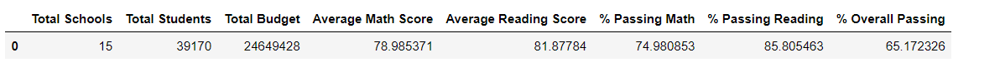
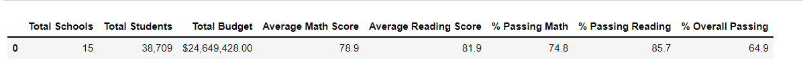
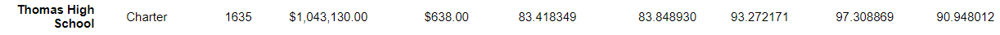
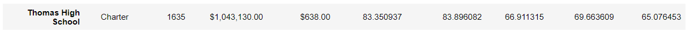
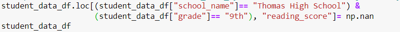

# School_District_Analysis 

## Overview

Maria is the cheif data scientist for a city school district and needs our help preparing standardized test data for analysis, reporting and presentation. This data will help to provide insight about performance trends and patterns, so they can make informed dicisions for the district going forward.
## Purpose
We will aggregate the data and showcase trends in school performance
## Results
### How is the district summary affected?  
#### Original Ditsrict Summary

 
#### Corrected District Summary

 
In comparing the changes in our district summaries we see the following changes:  
 
-Average Math Score Increased by .1 point  
-Percentage of students passing math increasded by .2 percent  
-Percentage of students passing reading decreased by .3 percent  
-Percentage of students passing reading and math overall decreased by .1 percent  
 
### How is the school summary affected?  
#### Original School Summary

 
#### Corrected School Summary

 
In comparing the changes in our district summaries we see the following changes: 
-There is little to no significant change. In order to see change numbers are format out to at least the hundreds place.
### How does replacing the ninth graders’ math and reading scores affect Thomas High School’s performance relative to the other schools?  
We were able to change the scores for this group using the following code:  
 

 
### How does replacing the ninth-grade scores affect the following:  
### Math and reading scores by grade  
#### Scores by school spending  
#### Scores by school size  
#### Scores by school type  
##Summary: Summarize four changes in the updated school district analysis after reading and math scores for the ninth grade at Thomas High School have been replaced with NaNs.
