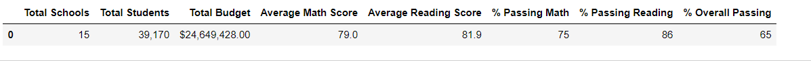
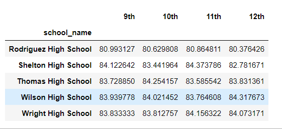
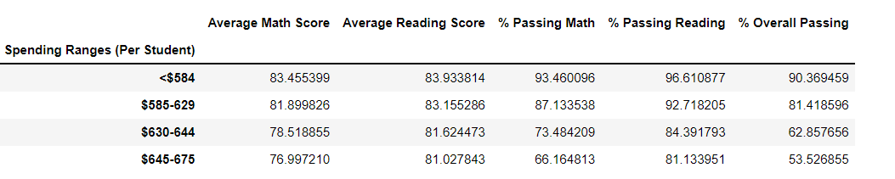

# School_District_Analysis 

## Overview

Maria is the chief data scientist for a city school district and needs our help preparing standardized test data for analysis, reporting and presentation. This data will help to provide insight about performance trends and patterns, so they can make informed dicisions for the district going forward.
## Purpose
We will aggregate the data and showcase trends in school performance
## Results
### How is the district summary affected?  
#### Original Ditsrict Summary

 
#### Corrected District Summary

### How is the school summary affected?  
In comparing the changes in our district summaries we see the following changes:  
 
-Total students decreased by 461 students  
-Average Math Score decreased by .1 point  
-Percentage of students passing math decreased by .2 percent  
-Percentage of students passing reading decreased by .3 percent  
-Percentage of students passing reading and math overall decreased by .1 percent  
 
#### Original School Summary

 
#### Corrected School Summary

 
In comparing the changes in our district summaries we see the following changes: 
*for some of our data, some of the changes are less significant with change going out to the hundreds place  
 
-The average math scores for the school decreased by .07 points  
-The average reading scores for the school decreased by .05 points  
-The percent passing math decreased by 26.36%  
-The percent passing reading decreased by 27.65%  
-The percent passing overall decreased by 25.87%  
 
### How does replacing the ninth graders’ math and reading scores affect Thomas High School’s performance relative to the other schools?  
We were able to change the scores for this group using the following code:  
 

 
Using this code we are able to replace the values for the ninth graders while still performing our mathematic functions. This makes the number of total students the same while there is less data to compute. This makes the scores significally lower for passing when compared to other schools becuase there are less scores for the total students.  
### How does replacing the ninth-grade scores affect the following:  
#### Math and reading scores by grade  
The code for replacing our math and reading scores by grade are shown below:  
 
 
 
 
 
 
 
 
The only significant change for each of the new dataframes is that for Thomas High School, 9th grade scores are now Nan. There is no affect on other grades.

#### Scores by school spending  
In comparing the difference in scores based on spending ranges we see the following changes:  
##### Original Scores by Spending Ranges
 
##### Original Scores by Spending Ranges
  
There are small changes in the third spending range $630-$644 because this is where Thomas High School lies  
 
-There is a .02 point decrease for average math scores  
-There is a .04 point decrease for average reading scores  
-There is a .02% decrease in percent passing math  
-There is a .08% decrease in percent passing reading  
-There is a .08% decrease in percent of students passing overall  

#### Original scores by school size  
In comparing the difference in scores based on school size we see the following changes:  
##### Original Scores by School Size
 
##### Corrected Scores by School Size
  
There are small changes in the third spending range $630-$644 because this is where Thomas High School lies  
 
-There is a .02 point decrease for average math scores  
-There is a .04 point decrease for average reading scores  
-There is a .02% decrease in percent passing math  
-There is a .08% decrease in percent passing reading  
-There is a .08% decrease in percent of students passing overall  
#### Original Scores by school type  
In comparing the difference in scores based on spending ranges we see the following changes:  
##### Original Scores by Schoo Type
 
##### Corrected Scores by School Type
 
There are small changes in the school type for charter schools because this is where Thomas High School lies  
 
-There is a .01% decrease for percent passing math  
-There is a .04% decrease for percent passing reading  
-There is a .04% decrease for overall passing  
## Summary 
As shown in our analysis above, the Thomas High School 9th grade scores had the biggest impact on the results for Thomas High school in the per_school_summary data frame. We saw dramatic decrease in their percent passing math with a decrease of 26.36%, the percent passing reading with a decrease of 27.65%, and the percent passing overall with a decrease of 25.87%. We also see major changes in the total district summary overall with percentage of students passing math decreased by .2% and
percentage of students passing reading decreased by .3%. We saw more changes through the analysis but they had little significance on the data set overall. The biggest impact on the scores were on the analysis on Thomas High School because the change in overall scores was not enough to have much impact on the districts scores. 
